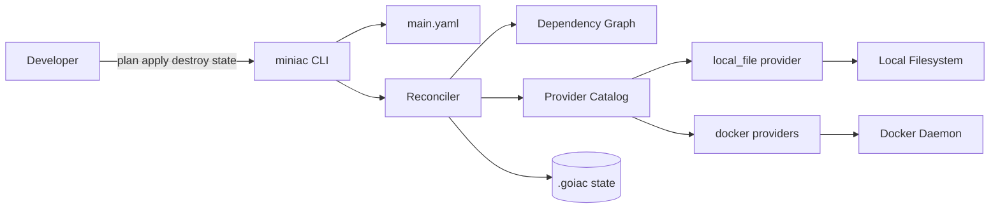

# MiniIaC

MiniIaC is a minimal Infrastructure-as-Code engine written in Go.

It reads a YAML configuration, computes a plan from the current state, and applies or destroys resources through pluggable providers. The project is intentionally small enough to study, extend, and use as a learning-oriented IaC engine.

Repository: [github.com/tishiu/MiniIaC](https://github.com/tishiu/MiniIaC)

## Architecture Overview



## What It Supports

| Resource Type | Required Properties | Optional Properties | Purpose |
|---|---|---|---|
| `local_file` | `path`, `content` | none | Manage files on the local filesystem |
| `docker_network` | `name` | `driver` | Manage Docker networks |
| `docker_container` | `image` | `port`, `network_id` | Manage Docker containers |

## Key Capabilities

- YAML-based resource definitions
- `plan`, `apply`, `destroy`, and `state show` workflows
- dependency graph validation and topological ordering
- transactional state persistence in `.goiac/`
- checksum validation for the state file
- file locking for state mutations
- provider catalog with schema defaults and validation
- Docker container creation that pulls missing images automatically

## Requirements

- Go `1.24+`
- Docker daemon, only if you use Docker resources

## Clone And Run

```bash
git clone https://github.com/tishiu/MiniIaC.git
cd MiniIaC
go run ./cmd help
```

To build a binary:

```bash
go build -o miniac ./cmd
./miniac help
```

## Quick Start

Initialize a project:

```bash
go run ./cmd init
```

That creates `.goiac/` and a starter `main.yaml` if one does not exist.

Preview the desired changes:

```bash
go run ./cmd plan main.yaml
```

Apply the configuration:

```bash
go run ./cmd apply main.yaml --auto-approve
```

Inspect recorded state:

```bash
go run ./cmd state show
```

Destroy all managed resources:

```bash
go run ./cmd destroy --auto-approve
```

## Example Configs

Ready-to-run examples live under [`example/`](example):

- [`example/local-file/main.yaml`](example/local-file/main.yaml): creates a local file
- [`example/docker-app/main.yaml`](example/docker-app/main.yaml): creates a Docker network and an Nginx container
- [`example/complex-dependency/main.yaml`](example/complex-dependency/main.yaml): demonstrates chained references across file, network, and container resources

Run any example directly:

```bash
go run ./cmd plan example/local-file/main.yaml
go run ./cmd apply example/local-file/main.yaml --auto-approve
```

## Configuration Format

```yaml
resources:
  - id: hello_file
    type: local_file
    properties:
      path: ./hello.txt
      content: "Hello from MiniIaC"
```

For dependency-heavy configs, see [`example/complex-dependency/main.yaml`](example/complex-dependency/main.yaml).

## CLI Commands

| Command | Purpose |
|---|---|
| `miniac init` | Initialize `.goiac/` and create a starter `main.yaml` if it does not exist |
| `miniac plan [config]` | Parse a config file and print the execution plan without changing infrastructure |
| `miniac apply [config] [--auto-approve]` | Apply the desired infrastructure from a config file |
| `miniac destroy [--auto-approve]` | Destroy all resources currently tracked in state |
| `miniac state show [resource-id]` | Show the full state, or inspect a single tracked resource |
| `miniac help` | Print CLI usage information |

Global flags:

| Flag | Purpose |
|---|---|
| `--log-level <debug|info|warn|error>` | Set the log verbosity |
| `--log-json` | Emit structured JSON logs |

If no command is passed, MiniIaC starts interactive mode.

## Architecture Summary

MiniIaC is organized around a few clear boundaries:

- `cmd/main.go`
  - command entrypoint and interactive shell
- `pkg/cli`
  - CLI use-case handlers for `init`, `plan`, `apply`, `destroy`, and `state`
- `pkg/config`
  - YAML parsing and validation
- `pkg/reconciler`
  - prepare/commit orchestration, diffing, and execution ordering
- `pkg/graph`
  - dependency extraction, DAG validation, and topological sorting
- `pkg/provider`
  - provider interfaces, catalog, schemas, and implementations
- `pkg/reference`
  - interpolation and dependency extraction helpers
- `pkg/state`
  - state loading, migration, locking, transactions, and checksums

Detailed diagrams are available in [`docs/architecture.md`](docs/architecture.md).

## State Files

MiniIaC stores local state in `.goiac/`:

| File | Purpose |
|---|---|
| `.goiac/state.json` | Current tracked infrastructure state |
| `.goiac/state.json.sha256` | Integrity checksum for the state file |
| `.goiac/state.lock` | Lock file used to protect state mutations |

This state is the source of truth for `plan`, `apply`, `destroy`, and `state show`.

## Project Layout

```text
cmd/                     CLI entrypoint
pkg/cli/                 command handlers
pkg/config/              YAML parser and config model
pkg/graph/               dependency graph and topological sort
pkg/provider/            provider interfaces and implementations
pkg/reconciler/          diffing and execution orchestration
pkg/reference/           interpolation and dependency extraction
pkg/state/               state persistence and locking
example/                 sample configurations
docs/                    architecture and supporting notes
```

## Testing

Run the full test suite with:

```bash
go test ./...
```
