# MiniIaC Architecture

This document reflects the current implementation in `cmd/` and `pkg/`.

## C4 Level 1: Context

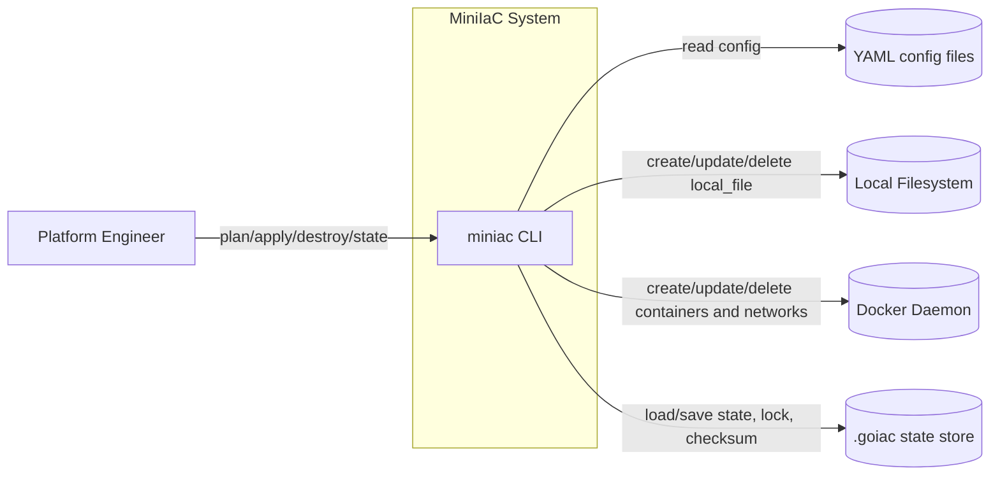

## C4 Level 2: Containers

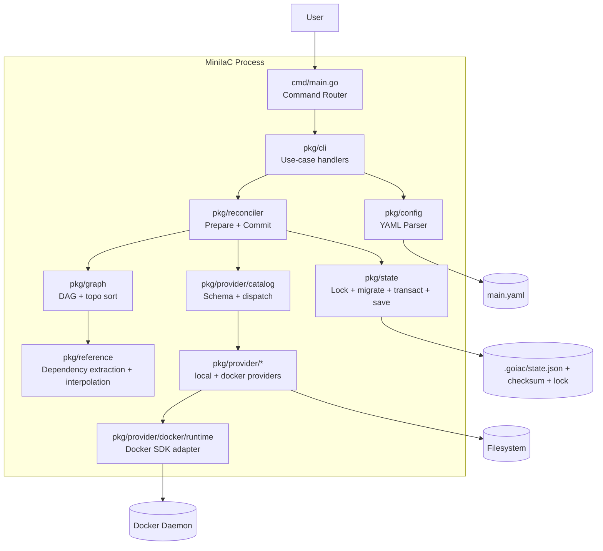

## C4 Level 3: Reconciliation Components

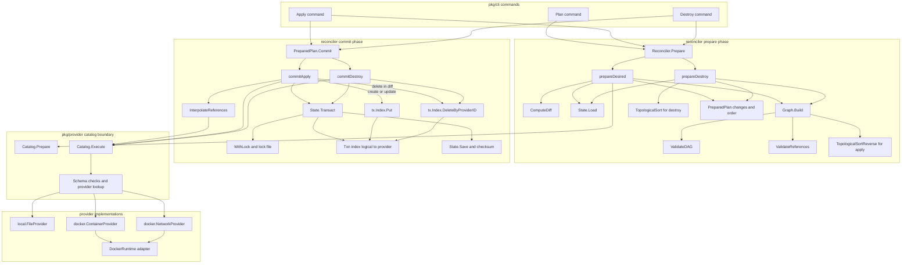

## Sequence: `apply`

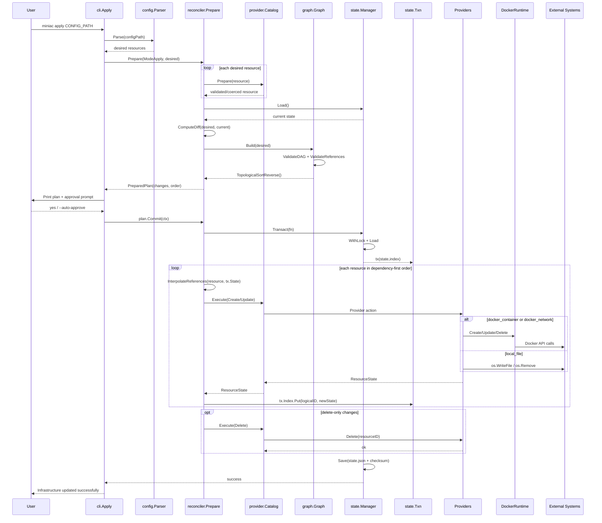

## Sequence: `destroy`

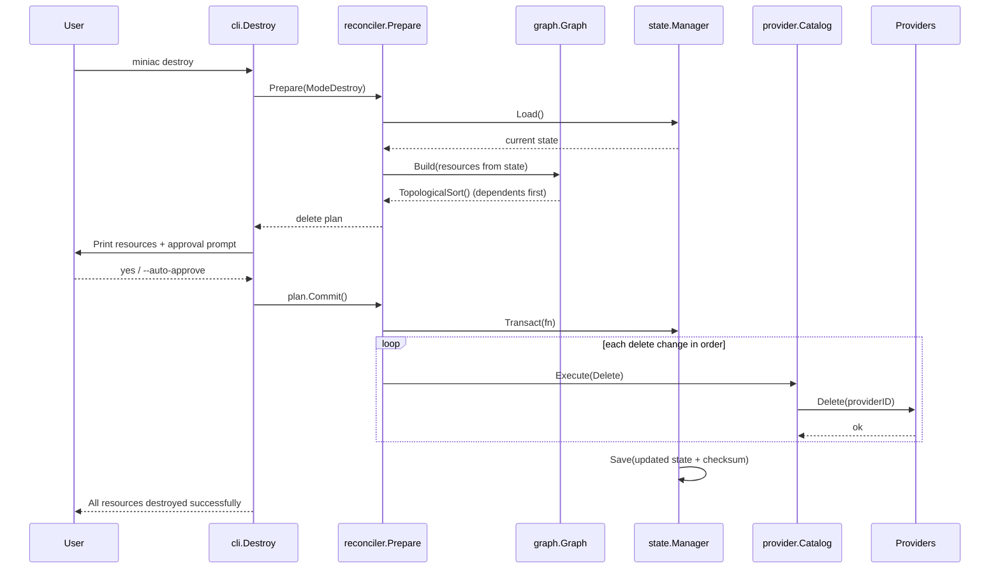

## State Transaction and Locking Flow

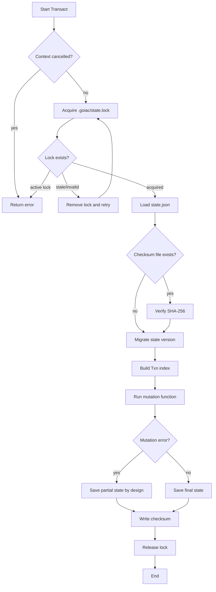

## Core Diagram: Command Dispatch and CLI Routing

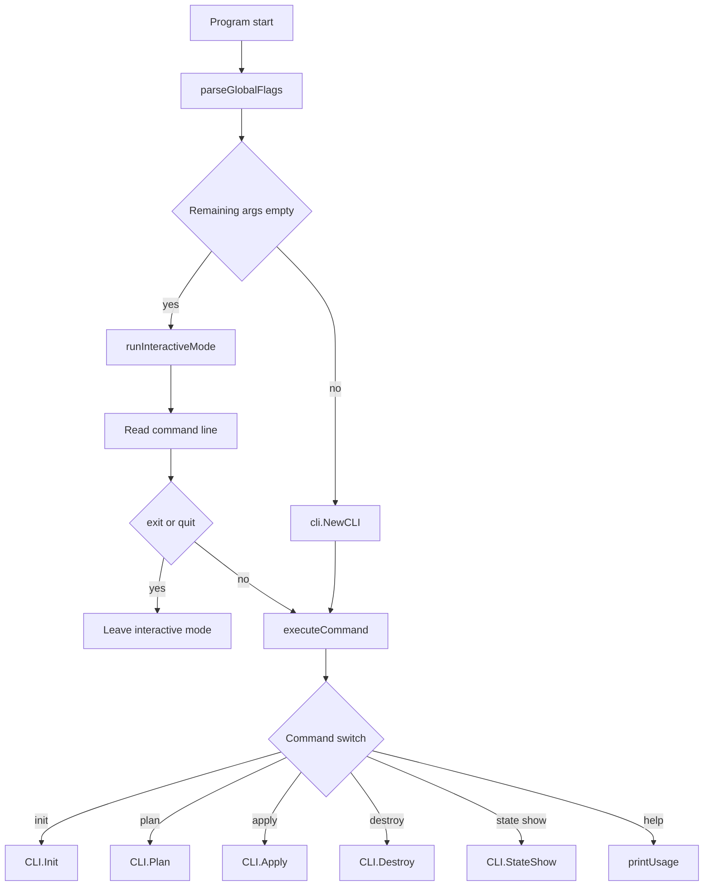

## Core Diagram: Diff Engine Decision Logic

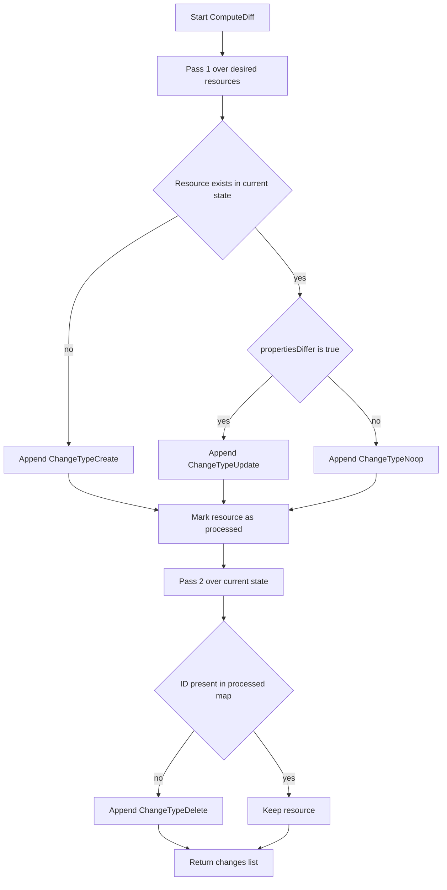

## Core Diagram: Reference Engine Resolution

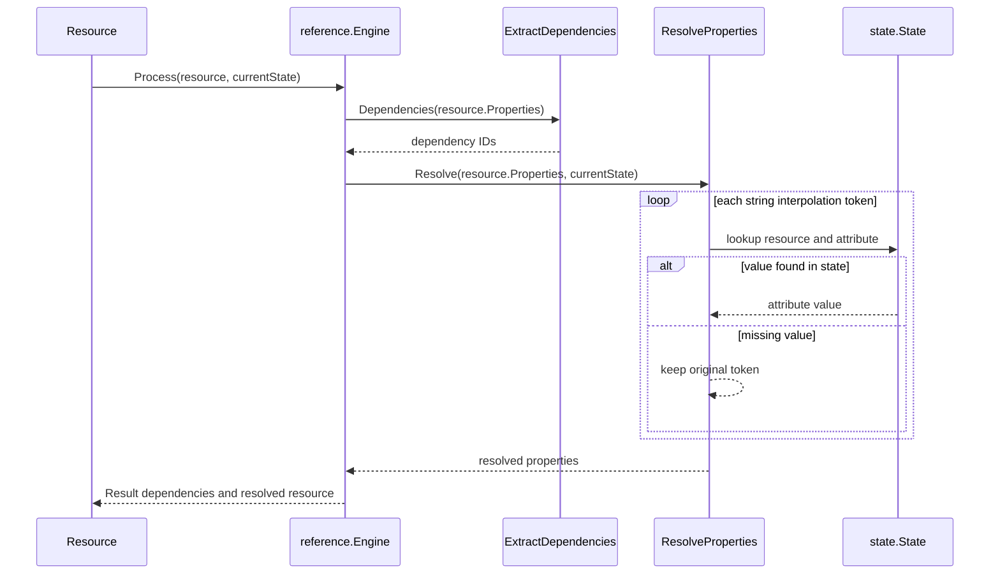

## Core Diagram: Dependency Ordering Semantics

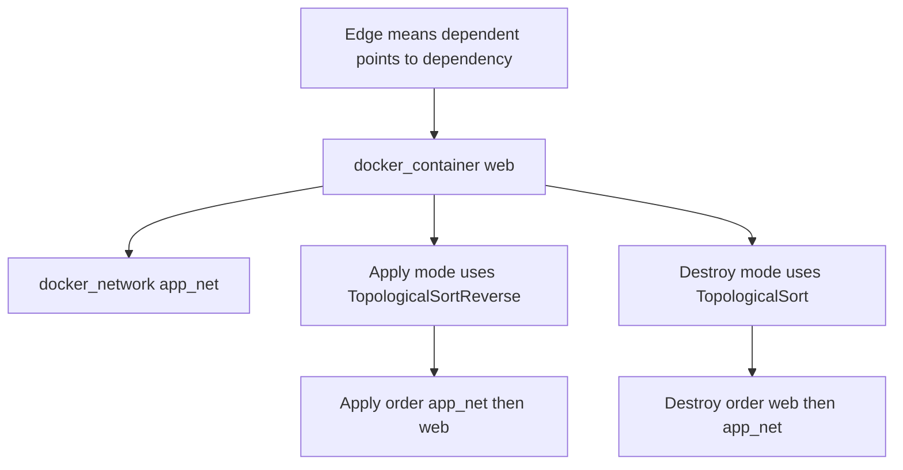

## Core Diagram: Provider Catalog Action State Machine

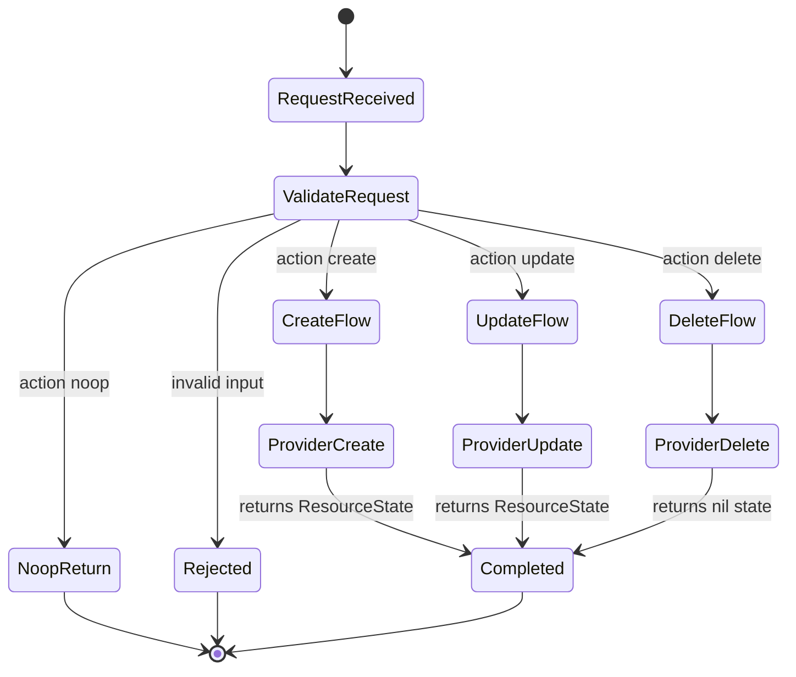

## Core Diagram: State Data Model

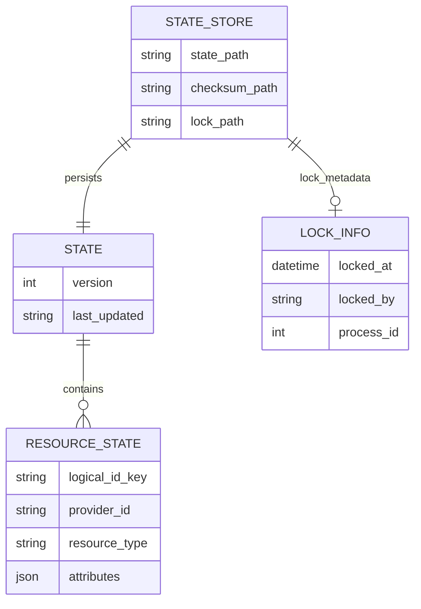
