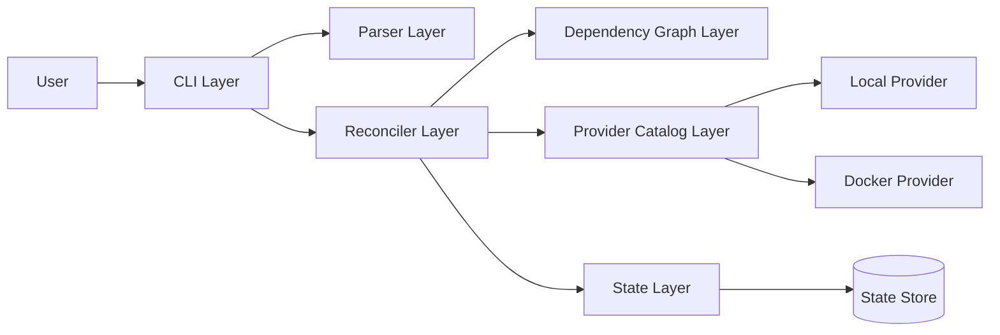
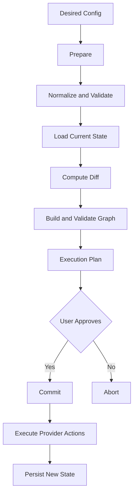
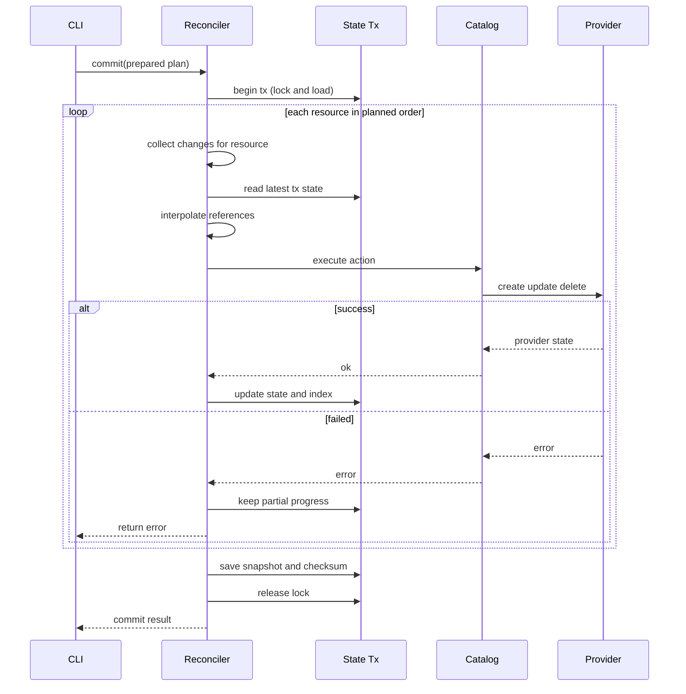
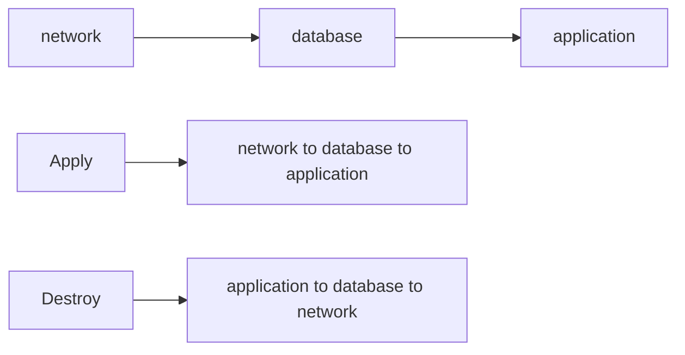
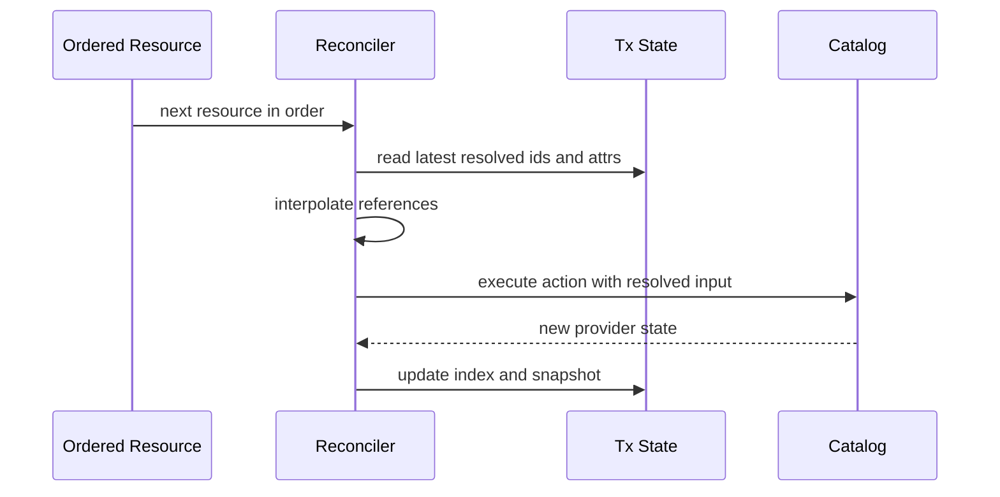
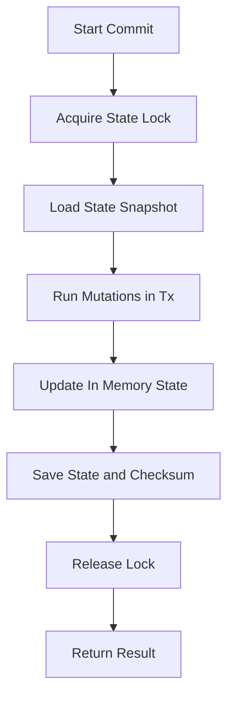
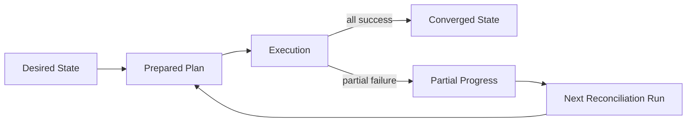
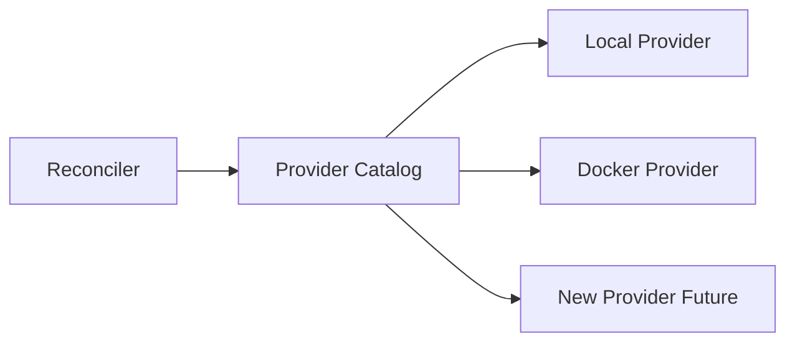
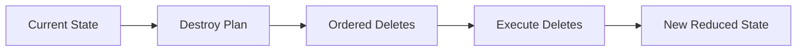
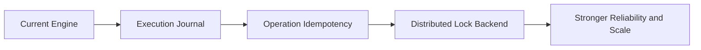

# Script phỏng vấn 12 phút - MiniIaC (Senior SWE narrative)

Mục tiêu bản này: bám sát mô tả trong CV, trả lời ở mức kiến trúc hệ thống và quyết định kỹ thuật, không đi vào liệt kê file code.

## 0) Opening (20 giây)

"MiniIaC là dự án em thiết kế như một IaC engine theo mô hình command-driven, với workflow `init/plan/apply/destroy/state`. Trọng tâm kỹ thuật là tách lớp rõ ràng và triển khai reconciliation hai pha `Prepare -> Commit` để tăng tính an toàn khi thay đổi hạ tầng."

---

## 1) Pattern: Why This Architecture (1.5 phút)

Bài toán em giải:
- Cần một engine IaC nhỏ gọn để quản lý tài nguyên local + Docker.
- Cần dự đoán thay đổi trước khi thi hành thật.
- Cần state nhất quán giữa các lần chạy command.

Quyết định kiến trúc:
- Tách lớp: `CLI -> Parser -> Graph -> Reconciler -> Provider -> State`.
- Mỗi lớp có một trách nhiệm rõ và một hợp đồng rõ.
- Reconciler là orchestration layer trung tâm, không để business rule tràn vào CLI.

Lý do tách lớp :
- Dễ test từng lớp độc lập.
- Dễ thay thế implementation (ví dụ provider mới) mà không phá orchestration.
- Giảm phu thuoc, tăng khả năng mở rộng theo chiều ngang chức năng.

Thông điệp chốt phần này:
- Đây là thiết kế theo boundary-first, không phải gom logic thành một command handler lớn.

---

## 2) Pattern: Two-Phase Reconciliation (2.5 phút)

Đây là core claim trong CV: `Prepare -> Commit`.

### Prepare phase (pure planning)
- Chuẩn hóa desired resources.
- Load current state.
- Compute diff: create/update/delete/noop.
- Validate dependency graph + reference integrity.
- Sinh execution order.

Invariant quan trọng:
- **Prepare không tạo side-effect lên external system.**

### Commit phase (controlled mutation)
- Nhận prepared plan đã qua validation và mở transaction boundary trên state.
- Chạy theo đúng execution order đã tính ở Prepare, không tái tính topology trong lúc chạy.
- Với mỗi resource theo thứ tự:
  1. Lấy change set của resource đó.
  2. Đọc tx-state mới nhất.
  3. Resolve reference/interpolation dựa trên dữ liệu mới nhất.
  4. Dispatch action qua catalog xuống provider (create/update/delete).
  5. Nếu thành công thì cập nhật in-memory state + logical to provider index.
- Sau vòng chính, xử lý các delete-only changes theo policy của plan.
- Save snapshot + checksum, release lock, trả kết quả.
- Nếu lỗi ở giữa chừng: dừng tại resource lỗi, trả error và giữ partial progress để reconcile ở lần chạy sau.

Invariants quan trọng:
- **Commit chỉ thực thi plan hợp lệ, không tự quyết định lại graph tại runtime.**
- **State mutation chỉ được phép diễn ra bên trong transaction boundary.**
- **Resource chạy sau luôn nhìn thấy output mới nhất của resource đã chạy thành công trước đó.**

Lợi ích kiến trúc:
- Tách risk assessment khỏi mutation path.
- Tạo trải nghiệm an toàn kiểu "preview trước, apply sau".
- Dễ audit logic planning độc lập với logic provider execution.

Trinh bay:
- "Commit phase của em bắt đầu bằng transaction trên state: lock rồi load snapshot hiện tại."
- "Sau đó engine không tự suy luận lại graph, mà chỉ thực thi đúng plan đã được Prepare validate."
- "Mỗi resource chạy theo order cố định: resolve reference từ tx-state mới nhất, gọi provider action, thành công thì update index và state ngay trong transaction."
- "Nếu fail giữa chừng thì stop tại điểm lỗi, trả error nhưng giữ partial progress để lần apply sau reconcile tiếp."
- "Kết thúc thì save state snapshot kèm checksum và release lock, nên correctness boundary rất rõ."

---

## 3) Pattern: Dependency and Ordering Semantics (1.5 phút)

MiniIaC không chỉ "sort DAG" chung chung, mà định nghĩa rõ execution semantics:
- Graph biểu diễn quan hệ phụ thuộc giữa resources.
- Apply phải chạy theo dependency-first.
- Destroy phải chạy theo dependent-first.

Giá trị thực tế:
- Tránh tạo resource khi nền tảng chưa sẵn sàng.
- Tránh xóa nền tảng khi resource phụ thuộc còn tồn tại.

Điểm senior nên nhấn:
- Ordering là domain rule cứng, không phải optimization phụ.

---

## 4) Pattern: Reference Interpolation Timing (1 phút)

Reference interpolation là điểm tinh tế trong reconciliation:
- Reference được resolve dựa trên state và mapping hiện có.
- Thời điểm resolve nằm trên execution path để dùng output mới nhất từ các bước trước.

Tại sao quan trọng:
- Cho phép chaining resource-to-resource trong cùng một apply.
- Giảm sai lệch giữa "plan time assumptions" và "commit time reality".

---

## 5) Pattern: State Management and Transaction Boundary (2 phút)

Tech stack của bạn có "File-based State Management", nên cần nói như một quyết định kiến trúc có chủ đích:
- State local giúp setup đơn giản, phù hợp CLI local-first.
- Có lock để tránh concurrent writer trên cùng state file.
- Có checksum để phát hiện corruption hoặc out-of-band modification.

Transaction boundary của MiniIaC:
- lock -> load -> mutate -> save -> unlock.

Invariant:
- **Mọi mutation hợp lệ phải đi qua state transaction boundary.**

Trade-off nói thẳng với interviewer:
- Mạnh ở single-node correctness.
- Chưa phải distributed coordination cho multi-node orchestration.

---

## 6) Pattern: Failure Semantics and Idempotency (1.5 phút)

Phần này nên trả lời theo engineering honesty:
- Model nhất quán là practical consistency cho IaC CLI.
- Khi fail giữa chừng có thể xuất hiện partial progress.
- Lần apply sau tiếp tục reconciliation để converge về desired state.

Tư duy thiết kế:
- Chấp nhận trade-off giữa atomic cross-resource và tính đơn giản/vận hành được.
- Ưu tiên khả năng recover theo reconciliation hơn là rollback tuyệt đối.

Điểm cộng nếu phỏng vấn hỏi sâu:
- Bạn nhận diện rõ boundary idempotency ở provider contract và apply-level behavior.

---

## 7) Pattern: Provider Abstraction and Extensibility (1 phút)

Provider layer được tổ chức theo catalog + action contract:
- Catalog nhận resource type và route đúng provider.
- Provider thực thi create/update/delete theo interface thống nhất.

Ý nghĩa kiến trúc:
- Reconciler không cần biết chi tiết Docker hay filesystem.
- Mở rộng provider mới mà không sửa core flow.

---

## 8) Destroy as First-Class Workflow (40 giây)

Destroy không phải phụ lục của apply:
- Có planning riêng từ current state.
- Có ordering semantics riêng để tháo dependency an toàn.
- Có state transition rõ sau mỗi lần commit.

---

## 9) Senior-Level Trade-offs and Evolution (1 phút)

Nếu cần nói ở mức Staff/Senior roadmap:
1. Thêm execution journal để resume/replay sau crash.
2. Tăng idempotency theo operation token.
3. Nâng cấp lock backend khi chạy multi-node.
4. Cải thiện observability: structured event log cho từng resource action.

---

## 10) Closing (20 giây)

"Điểm em tự tin nhất ở MiniIaC là em không chỉ build được workflow IaC, mà còn định nghĩa rõ system boundaries, invariants, và trade-offs. Thiết kế hai pha reconciliation và tách lớp ngay từ đầu giúp hệ thống an toàn hơn khi scale chức năng và đội ngũ."

---

## 11) Q&A nhanh kiểu Senior (dùng khi bị hỏi xoáy)

1. Vì sao không gom luôn plan + apply một pha?
   - Vì tách pha giảm rủi ro và tăng khả năng review thay đổi trước mutation.
2. Tại sao chọn file-based state thay vì DB ngay từ đầu?
   - Vì ưu tiên đơn giản vận hành cho local-first IaC; DB là bước tiến hóa khi có multi-node và concurrency cao.
3. Boundary của correctness nằm ở đâu?
   - Ở transaction state boundary + graph-validated execution order.
4. Failure giữa chừng xử lý triết lý nào?
   - Reconciliation-driven recovery: ghi nhận tiến độ và converge qua lần chạy kế tiếp.
5. Khi nào kiến trúc hiện tại không còn đủ?
   - Khi cần distributed coordination, audit mạnh, và reliability SLO cao hơn local CLI.
