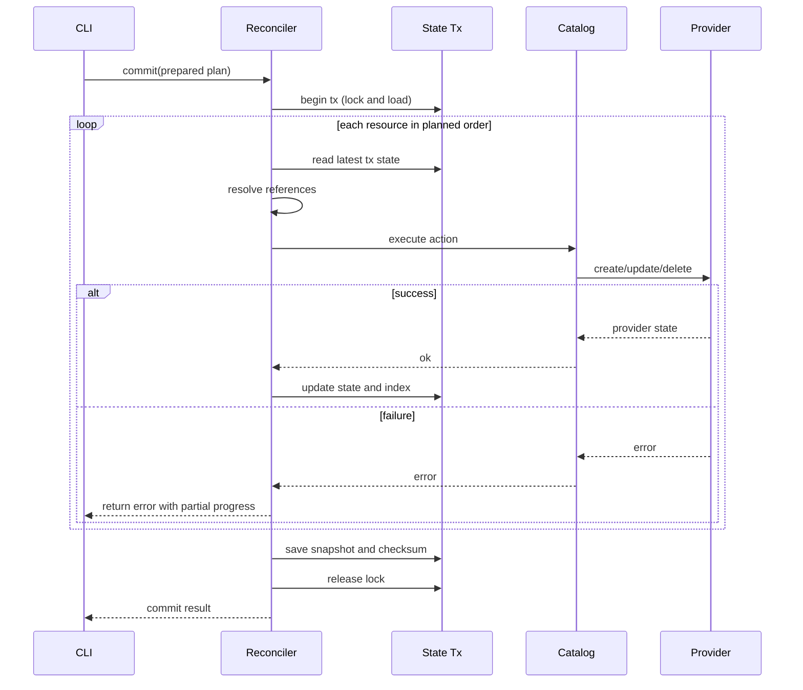

# Nguyên lý sử dụng Reconciliation trong MiniIaC

Tài liệu này dùng để trả lời phỏng vấn theo kiểu senior: hệ thống dùng dữ liệu gì, dựa trên nguyên tắc nào để ra quyết định, các case quan trọng, và commit chạy như thế nào.

## 1) Dùng cái gì?

Reconciliation của MiniIaC dùng 5 nguồn chính:

1. `Desired state` từ YAML config
- Mô tả tài nguyên mong muốn sau khi apply.

2. `Current state` từ state store
- Snapshot hiện tại của hạ tầng theo góc nhìn engine.
- Bao gồm mapping logical ID sang provider ID.

3. `Provider catalog + schema`
- Xác định loại resource nào được hỗ trợ.
- Xác định action contract `create/update/delete` cho từng provider.

4. `Dependency graph + references`
- Xác định quan hệ phụ thuộc giữa resources.
- Quyết định execution order cho apply/destroy.

5. `Execution mode`
- `plan`: chỉ tính toán, không side-effect.
- `apply`: hội tụ về desired state.
- `destroy`: hội tụ về empty/reduced state.

---

## 2) Dựa trên cái gì để ra quyết định?

Engine ra quyết định dựa trên 4 nguyên lý cứng:

1. Diff-driven
- So sánh desired và current để phân loại `create/update/delete/noop`.

2. Graph-aware ordering
- Không chạy theo thứ tự khai báo YAML.
- Chạy theo dependency semantics để đảm bảo tính đúng đắn.

3. Two-phase safety
- `Prepare` chỉ phân tích và validate.
- `Commit` mới được phép mutation external systems.

4. State-transaction boundary
- Mọi cập nhật state phải đi qua `lock -> load -> mutate -> save`.

---

## 3) Câu lệnh sử dụng (bổ sung)

### Command chính

| Command | Mục đích |
|---|---|
| `miniac init` | Khởi tạo workspace IaC (`.goiac/` và config mẫu) |
| `miniac plan [config]` | Parse + diff + graph validate, in plan thay đổi |
| `miniac apply [config] [--auto-approve]` | Thực thi thay đổi theo plan |
| `miniac destroy [--auto-approve]` | Xóa toàn bộ resources đã quản lý |
| `miniac state show [resource-id]` | Xem state tổng hoặc từng resource |

### Global flags hay dùng

| Flag | Ý nghĩa |
|---|---|
| `--log-level <debug|info|warn|error>` | Tăng/giảm độ chi tiết log |
| `--log-json` | Xuất log JSON cho CI/log aggregation |
| `--auto-approve` | Bỏ prompt xác nhận ở apply/destroy |

### Flow chạy nhanh trong thực tế

```bash
miniac init
miniac plan main.yaml
miniac apply main.yaml
miniac state show
miniac destroy --auto-approve
```

---

## 4) Case matrix chính (nói trong phỏng vấn)

| Case | Điều kiện | Quyết định ở Prepare | Hành vi ở Commit | Kết quả mong đợi |
|---|---|---|---|---|
| Create | Resource có trong desired, chưa có trong current | `create` | Gọi provider create, update state/index | Resource mới xuất hiện trong state |
| Update | Resource có ở cả hai phía nhưng drift | `update` | Gọi provider update (hoặc recreate tùy provider) | State phản ánh cấu hình mới |
| Delete | Resource có trong current nhưng không còn trong desired | `delete` | Gọi provider delete, remove mapping | Resource bị gỡ khỏi state |
| Noop | Desired == current sau normalize | `noop` | Không gọi provider | Không đổi state nghiệp vụ |
| Cycle dependency | Graph có chu trình | Fail prepare | Không commit | Chặn thay đổi nguy hiểm |
| Missing reference | Reference trỏ tới resource không hợp lệ | Fail prepare | Không commit | Chặn plan sai |
| Provider error giữa chừng | 1 action thất bại trong commit | Plan vẫn hợp lệ | Stop tại lỗi, trả error, giữ phần đã thành công | Lần apply sau reconcile tiếp |
| Lock contention | Có writer khác đang giữ lock | Prepare có thể thành công | Commit retry lock rồi fail nếu không lấy được | Không có concurrent writer cùng state file |

---

## 5) Commit chạy như thế nào?

Commit là runtime mutation có kiểm soát, đi theo chuỗi bước cố định:

1. Bắt đầu transaction trên state manager.
2. Acquire lock cho state file để đảm bảo single writer.
3. Load snapshot state hiện tại vào transaction context.
4. Duyệt resources theo execution order đã tính ở Prepare.
5. Với mỗi resource:
- Lấy change set tương ứng.
- Resolve references/interpolation dựa trên tx-state mới nhất.
- Dispatch action qua catalog đến provider.
- Nếu success: cập nhật in-memory state và logical-to-provider index.
- Nếu fail: dừng tại điểm lỗi, trả error, giữ partial progress.
6. Sau vòng chính, xử lý nhóm delete theo policy của plan.
7. Save state snapshot mới + checksum.
8. Release lock và trả kết quả commit.



---

## 6) Invariants cần nhớ

1. Prepare không được tạo side-effect.
2. Commit không được tự tái tính graph/topology.
3. Resource chạy sau nhìn thấy output mới nhất của resource chạy trước.
4. State mutation chỉ hợp lệ trong transaction boundary.
5. Hệ thống ưu tiên reconciliation recovery hơn rollback tuyệt đối.

---

## 7) Cách nói nhanh 60 giây trong phỏng vấn

"MiniIaC dùng YAML desired state, current state snapshot, provider catalog và dependency graph để reconcile. Quyết định thay đổi là diff-driven, nhưng execution là graph-aware nên thứ tự chạy đảm bảo dependency semantics. Commit luôn bắt đầu bằng transaction boundary trên state: lock, load, chạy từng resource theo order đã chuẩn bị, resolve reference bằng tx-state mới nhất, gọi provider action và cập nhật state/index ngay khi thành công. Nếu lỗi giữa chừng thì stop tại điểm lỗi, trả error và giữ partial progress để lần apply sau hội tụ tiếp. Kết thúc commit là save snapshot kèm checksum và release lock."

---

## 8) Các câu interviewer hay bắt bẻ

1. "Có atomic all-or-nothing không?"
- Không theo nghĩa cross-resource distributed transaction; model hiện tại là practical consistency + reconciliation.

2. "Exactly-once ở đâu?"
- Không claim exactly-once toàn hệ thống; kiểm soát chính nằm ở execution order, idempotent contract từng action, và state transaction boundary.

3. "Khi nào cần nâng cấp kiến trúc?"
- Khi cần multi-node coordination, audit/replay mạnh, hoặc reliability SLO cao hơn CLI local-first.
